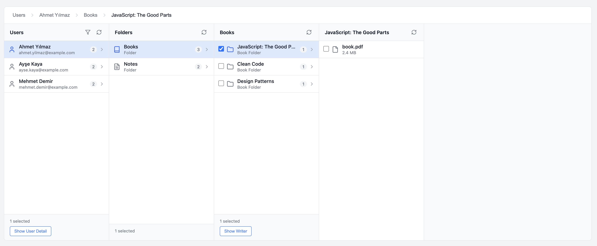

# Vue Column Explorer

A powerful, flexible, and easy-to-use multi-column explorer component for Vue 3.



## ✨ Features

- 🎯 **Easy to Use**: Create columns in seconds with `createColumn` helper
- 🔄 **Multi-Column Navigation**: macOS Finder-style navigation
- 🎨 **Lucide Icons**: 1000+ built-in icons support
- ✅ **Multiple Selection**: Single or multiple item selection
- 🔍 **Filtering**: Search, number, and select filters
- 📱 **Responsive**: Mobile-friendly design
- 🎭 **Actions**: Actions for selected items (Send Mail, Download, etc.)
- 🍞 **Breadcrumb**: Breadcrumb navigation for going back
- ⚡ **TypeScript**: Full type support
- 📦 **Zero Dependencies**: Only Vue 3 and Pinia

## 🚀 Quick Start

### Installation

```bash
npm install vue-column-explorer
```

### Basic Usage

**1. Create a column:**

```javascript
// columns/users.js
import { createColumn } from 'vue-column-explorer'

export const usersColumn = createColumn({
  id: 'users',
  name: 'Users',

  fetchData: () => {
    return [
      {
        id: '1',
        name: 'John Doe',
        type: 'user',
        icon: 'lucide:user',
        count: 5  // Count displayed on the right
      }
    ]
  },

  onItemClick: (item) => {
    return createNextColumn(item.id)
  }
})
```

**2. Add to your app:**

```vue
<template>
  <ExplorerContainer :root-column="usersColumn" />
</template>

<script setup>
import { ExplorerContainer } from 'vue-column-explorer'
import { usersColumn } from './columns/users'
import 'vue-column-explorer/dist/style.css'
</script>
```

**That's it!** 🎉

## 📖 Detailed Usage

For a detailed usage guide, see: [USAGE.md](./USAGE.md)

## 🎬 Demo

```bash
npm install
npm run dev
```

Open http://localhost:5173

### Demo Features

✅ User search and age filtering
✅ Multi-level navigation (Users → Folders → Books → Files)
✅ Folder and file counts
✅ Multiple selection and bulk operations
✅ Send Mail and Download actions
✅ Breadcrumb navigation

## 📁 Example Project Structure

```
example/
├── columns/
│   ├── users.ts       # Users column
│   ├── folders.ts     # Folders column
│   ├── books.ts       # Books column
│   ├── notes.ts       # Notes column
│   └── bookFiles.ts   # Files column
├── mockData.ts        # Sample data
└── App.vue            # Main component
```

Each column file is independent and easy to understand!

## 🎯 createColumn API

```typescript
createColumn({
  id: string                    // Unique ID
  name: string                  // Column title
  fetchData: (params) => Item[] // Data fetching function
  onItemClick?: (item) => Column | null  // Click handler
  allowMultipleSelection?: boolean       // Multiple selection
  singleActions?: Action[]               // Actions for single selection
  multipleActions?: Action[]             // Actions for multiple selection
  filters?: Filter[]                     // Filters
})
```

## 🎨 Item Structure

```javascript
{
  id: 'unique-id',        // Required
  name: 'Name',           // Required
  type: 'user|folder|file', // Required
  icon: 'lucide:user',    // Optional
  metadata: { ... },      // Optional (subtitle)
  count: 5,               // Optional (count on right)
  hasChildren: true       // Optional (show chevron)
}
```

## 💡 Examples

### Simple Column

```javascript
export const usersColumn = createColumn({
  id: 'users',
  name: 'Users',
  fetchData: () => getUsers(),
  onItemClick: (item) => createFoldersColumn(item.id)
})
```

### Column with Filters

```javascript
export const usersColumn = createColumn({
  id: 'users',
  name: 'Users',

  fetchData: ({ filters }) => {
    let users = getUsers()
    if (filters.search) {
      users = users.filter(u => u.name.includes(filters.search))
    }
    return users
  },

  filters: [
    { key: 'search', label: 'Search', type: 'search' },
    { key: 'age', label: 'Age >', type: 'number' }
  ]
})
```

### Column with Actions

```javascript
export const filesColumn = createColumn({
  id: 'files',
  name: 'Files',
  fetchData: () => getFiles(),

  allowMultipleSelection: true,

  singleActions: [
    {
      key: 'view',
      label: 'View Details',
      icon: 'lucide:eye',
      handler: (ids) => viewDetails(ids[0])
    }
  ],

  multipleActions: [
    {
      key: 'mail',
      label: 'Send Mail',
      icon: 'lucide:mail',
      handler: (ids) => sendMail(ids)
    },
    {
      key: 'download',
      label: 'Download',
      icon: 'lucide:download',
      handler: (ids) => download(ids)
    }
  ]
})
```

## 📚 Documentation

- [USAGE.md](./USAGE.md) - Detailed usage guide
- [SIMPLE_USAGE.md](./SIMPLE_USAGE.md) - Simple usage guide (Turkish)
- [CLAUDE.md](./CLAUDE.md) - 🤖 **Technical architecture for Claude** (code development)
- [PROJECT_SUMMARY.md](./PROJECT_SUMMARY.md) - Project summary
- [CHANGELOG.md](./CHANGELOG.md) - Change log

## 🛠️ Development

```bash
# Install dependencies
npm install

# Dev server
npm run dev

# Type check
npm run type-check

# Build
npm run build
```

## 📦 Technologies

- Vue 3 (Composition API)
- TypeScript
- Pinia (State management)
- Vite
- Lucide Icons

## 📄 License

MIT

---

**Easy integration, powerful features!** 🚀
